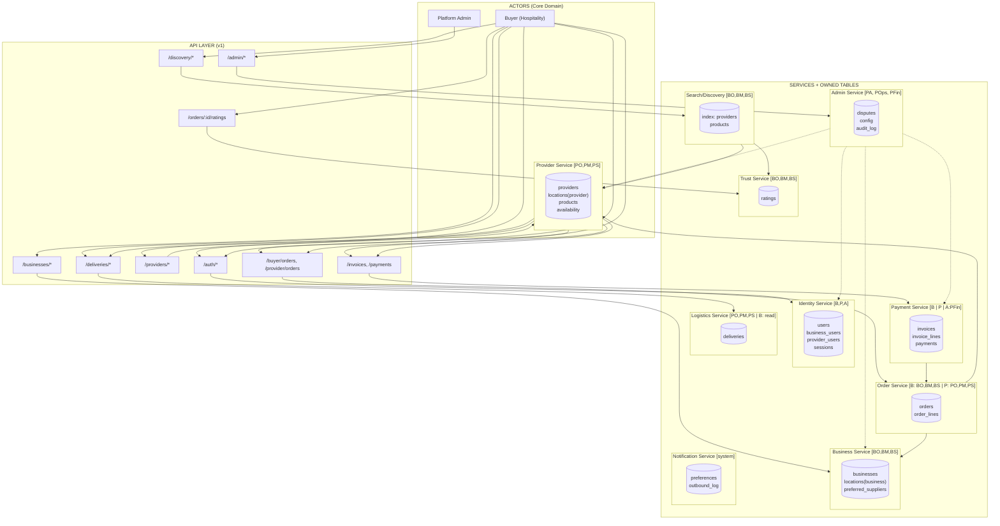
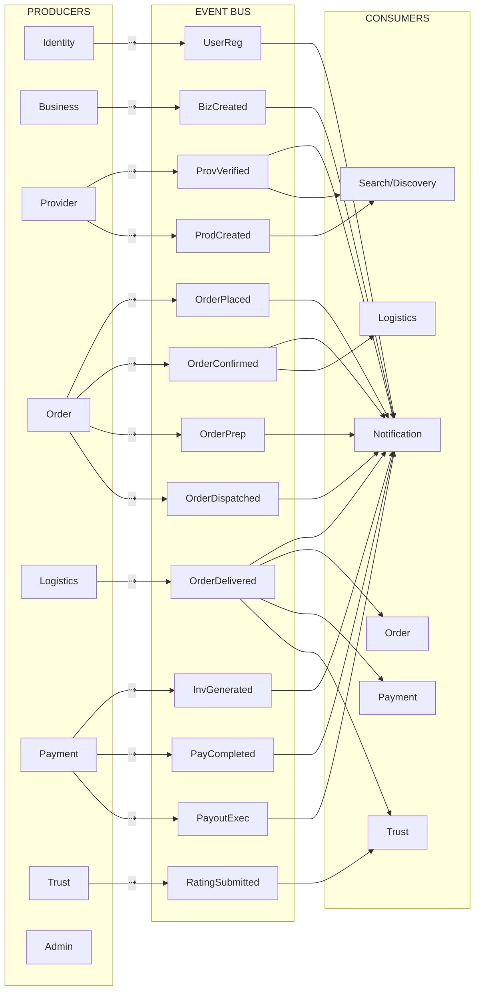
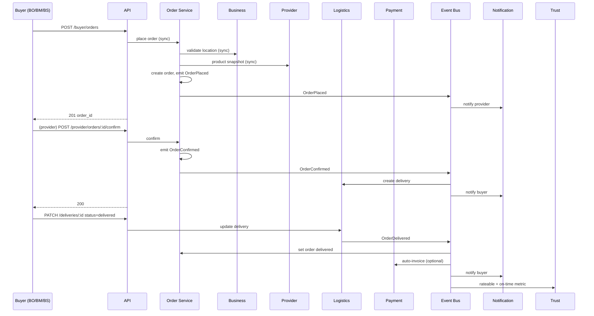
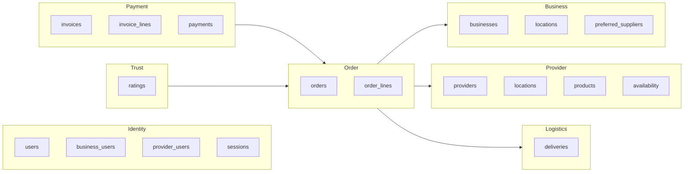
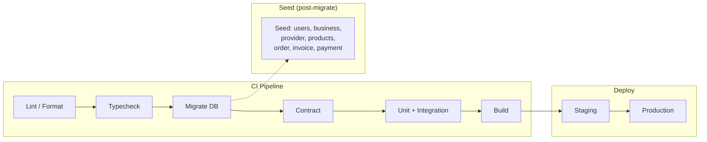

# MVP System Overview — One-Page Diagram

## Layers, services, ownership, events, and flows

MVP-only. Aligned with Core Domain (00), Permission Model (08), Service Boundaries (09), Event Flow (10), Feature Map (11), API Skeleton (12), DB Schema (13), Integration Tests (14), CI/CD + Seed (15).

---

## Legend

| Symbol / Arrow | Meaning                                                          |
| -------------- | ---------------------------------------------------------------- |
| **→** (solid)  | Sync: API call or request/response                               |
| **⇢** (dashed) | Async: event emitted or consumed                                 |
| **Owner**      | Service that owns and writes the data (single writer)            |
| **Role**       | Allowed role(s) for API access (B=Buyer, P=Provider, A=Platform) |
| **DB**         | Table(s) owned by the service (from schema 13)                   |

**Roles (abbrev):** BO=BusinessOwner, BM=BusinessManager, BS=BusinessStaff | PO=ProviderOwner, PM=ProviderManager, PS=ProviderStaff | PA=PlatformAdmin, POps=PlatformOps, PFin=PlatformFinance

---

## Diagram 1: System layers (actors → API → services → data)

---

## Diagram 2: Event flow (producers → consumers)

**Event shorthand:** UserReg=UserRegistered, BizCreated=BusinessCreated, ProvVerified=ProviderVerified, ProdCreated=ProductCreated, OrderPlaced/Confirmed/Prep/Dispatched/Delivered, InvGenerated=InvoiceGenerated, PayCompleted=PaymentCompleted, PayoutExec=PayoutExecuted, RatingSubmitted.

---

## Diagram 3: Order lifecycle (sync + async)

---

## Diagram 4: Data ownership (service → tables)

---

## Diagram 5: CI/CD + seed (annotation)

**Triggers:** PR → Validate + Migrate + Test + Build; Merge to main → + Deploy Staging; Production → manual. Seed: idempotent script after migrations (local / CI test DB).

---

## Summary table (MVP)

| Layer                | MVP contents                                                                                                                                                                                                                                                                                        |
| -------------------- | --------------------------------------------------------------------------------------------------------------------------------------------------------------------------------------------------------------------------------------------------------------------------------------------------- | -------------------------------------------------------------------- |
| **Actors**           | Buyer (hospitality), Provider (supplier), Platform Admin                                                                                                                                                                                                                                            |
| **Roles**            | BusinessOwner/Manager/Staff, ProviderOwner/Manager/Staff, PlatformAdmin/Ops/Finance                                                                                                                                                                                                                 |
| **Core services**    | Identity, Business, Provider, Order, Logistics, Payment, Trust                                                                                                                                                                                                                                      |
| **Support services** | Search/Discovery, Notification, Admin                                                                                                                                                                                                                                                               |
| **API**              | /auth, /businesses, /providers, /discovery, /buyer                                                                                                                                                                                                                                                  | provider/orders, /deliveries, /invoices, /payments, /ratings, /admin |
| **Events (MVP)**     | UserRegistered, BusinessCreated, ProviderVerified, ProductCreated, OrderPlaced, OrderConfirmed, OrderPrepared, OrderDispatched, OrderDelivered, InvoiceGenerated, PaymentCompleted, PayoutExecuted, RatingSubmitted                                                                                 |
| **DB (owner)**       | Identity → users, business_users, provider_users, sessions; Business → businesses, locations(b), preferred_suppliers; Provider → providers, locations(p), products, availability; Order → orders, order_lines; Logistics → deliveries; Payment → invoices, invoice_lines, payments; Trust → ratings |
| **Flows**            | Register → Business/Provider → Discovery → Place order → Confirm → Delivery → Invoice → Pay → Rate; permissions enforced per role; failure paths (403/404/409) per Integration Test Plan                                                                                                            |
